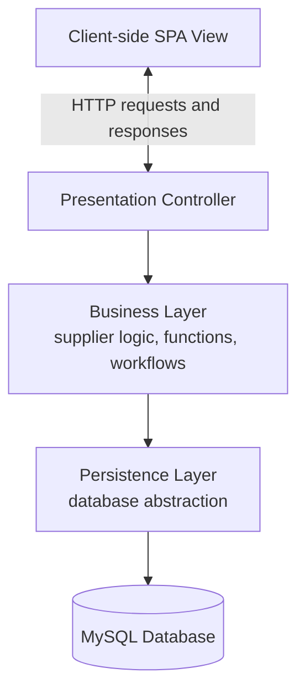
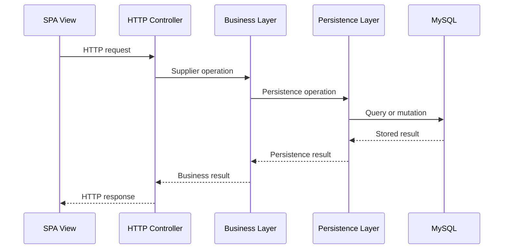
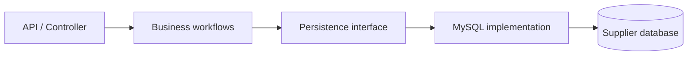
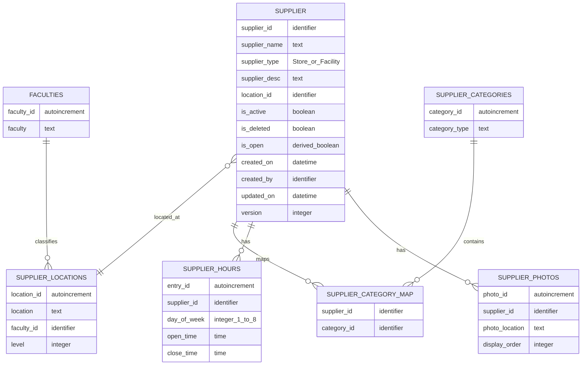
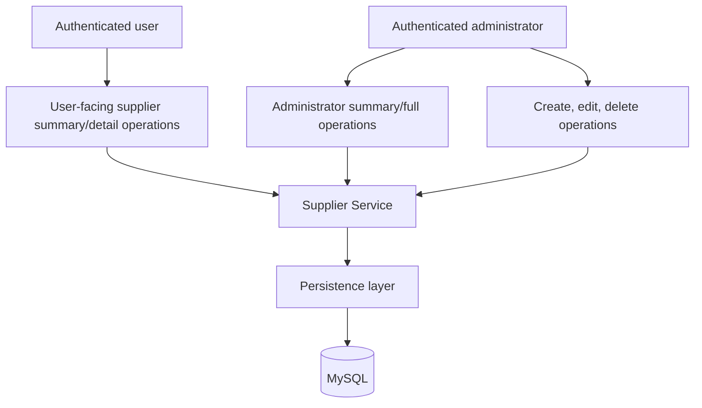
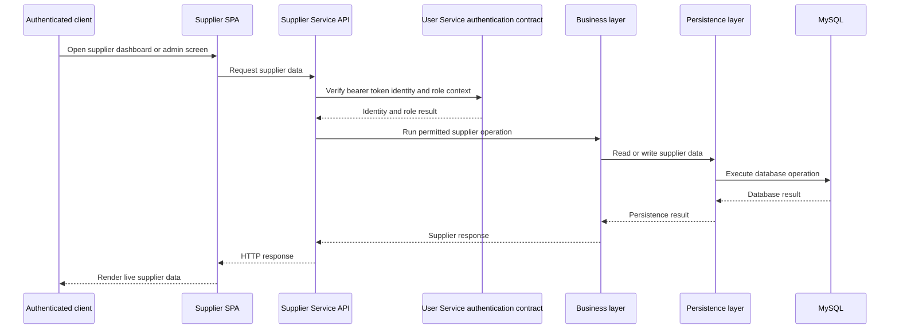
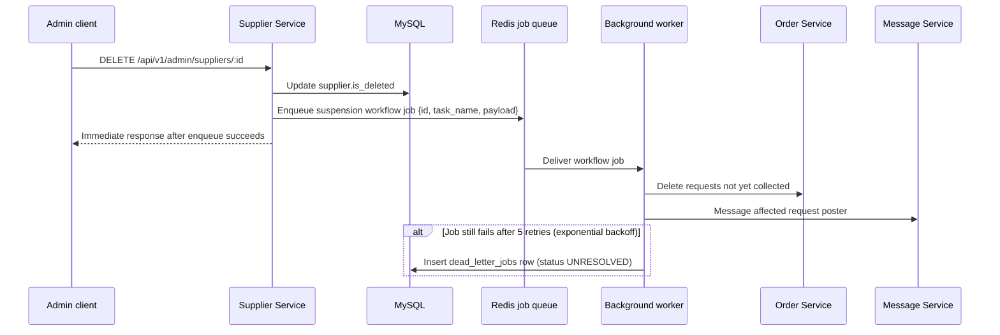
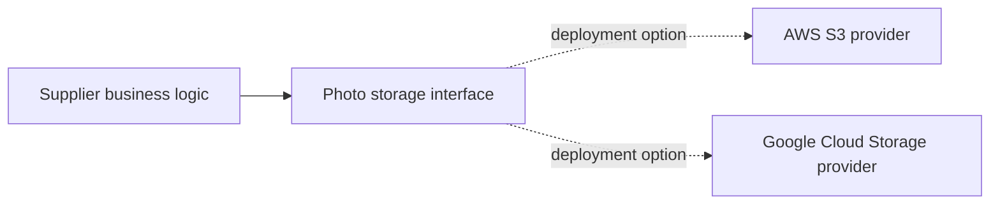
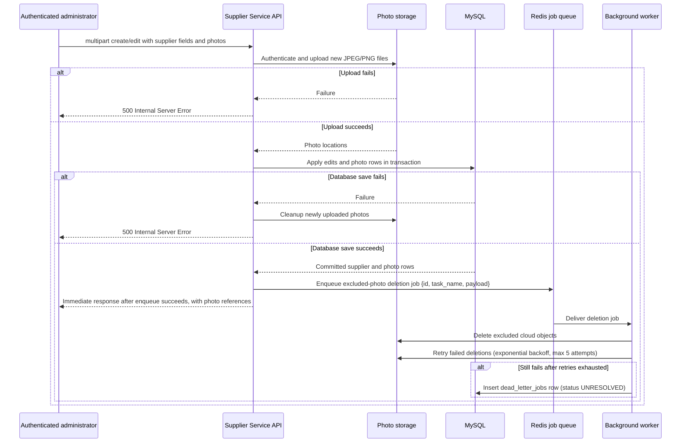

<!--
AI Assistance Disclosure:
Tool: Codex (model: GPT-5), date: 2026-09-25
Scope: Formatted the team-supplied Supplier Service architecture, data entities, API operation inventory, Mermaid diagrams, and factual requirement-traceability notes. No requirements, architecture, schema, or API decisions were made by the AI tool.
Author review: Congchen
Scope: 2026-09-25 update — recorded the team-supplied endpoint contracts, status codes, query pagination, role model, soft-delete workflow, and concrete table fields; added further factual gap notes.
Author review: Congchen
Scope: 2026-09-26 update — filled the supplied traceability items with fixed pagination, search/sort behavior, auth-provider ownership, visibility rules, derived open state, API envelopes, and request examples.
Author review: Congchen
Scope: 2026-09-26 update — recorded multipart photo management, Google OAuth, assumed downstream entrypoints, normalized faculty/location tables, and concrete MySQL DDL.
Author review: Congchen
Scope: 2026-09-27 update — aligned authentication with the repository's User Service RS256 JWT contract; replaced photo mapping with one-to-many storage, added photo-dirty ordering semantics, `updatedOn`, and lookup metadata.
Author review: Congchen
Scope: 2026-09-27 update — recorded separate lazy-loaded reference endpoints, the fixed error envelope, fixed query controls, Singapore time and overnight-hour behavior, placeholder resolution, and MySQL-first photo deletion ordering.
Author review: Congchen
Scope: 2026-09-27 update — opened reference endpoints to all roles, added a status-code mapping template, and recorded the Redis-backed worker and retry flow for photo and downstream workflows.
Author review: Congchen
Scope: 2026-09-27 update — recorded the team-supplied optimistic-concurrency version column, hours/photo uniqueness constraints, SGT-only timestamps, super_admin/admin capability note, lookup-table management endpoints, idempotency and rate-limiting rules, signed photo URLs, same-origin deployment, and `/api/v1` versioning.
Author review: Congchen
Scope: 2026-09-27 update — recorded the team-supplied immediate-response contract after job enqueue, the generic Redis job payload and exponential-backoff retry policy, the dead-letter-jobs table, the finalized `Idempotency-Key` header name, the 24-hour signed photo URL duration, and the continued deferral of downstream Order/Message Service contracts.
Author review: Congchen
Scope: 2026-09-28 update — recorded the team-supplied API-gateway explanation for same-origin deployment, the supplier name/type/location uniqueness constraint, confirmation of `supplier_id` as a stable cross-service reference, and clarification that `is_active` toggling is independent of soft-delete (`is_deleted`).
Author review: Congchen
Scope: 2026-09-28 update — recorded the team-supplied resolution that recreating a soft-deleted supplier's exact name/type/location reverses the soft delete and applies the create request as an update instead of inserting a new row.
Author review: Congchen
Scope: 2026-09-28 update — recorded the team-supplied decision that photos submitted on the reactivation path replace the reactivated supplier's existing photo rows entirely.
Author review: Congchen
Scope: 2026-09-28 update — replaced the `super_admin` role literal with `super admin` (space)
       throughout, per the team's resolution of a naming mismatch discovered against the User
       Service's actual `role_enum`/`GET /auth/verify` after merging `main` into `supplier-service`.
Author review: Congchen
Scope: 2026-09-29 update — recorded the team's Phase 1 decisions: an `isOpen` list filter, an
       always-enforced fixed `limit` of 50 (any other value is an error), the `sortOrder` default and
       past-last-page behavior, `404` for an unknown supplier id, the `00:00`–`23:59` 24-hour
       convention with its dedicated `is_open` check, rejection of equal open/close times, the
       unconfirmed status of the 24-hour signed-URL validity, and the reference category key. Tool:
       Claude Code (model: claude-sonnet-5). No decisions were made by the AI tool; each was supplied
       by the team in chat.
Author review: Congchen
Scope: 2026-09-29 update — recorded the team's Phase 2 decisions: the photo-storage interface
       operations and its local photo store (a separate MySQL instance), multer for multipart parsing, lookup-management
       delete/error responses, the photo-only-`photoId`/`photoLocation` create response, the
       reactivation response and `updated_on`/`version` behavior, the mandatory `Idempotency-Key`
       rules, server-filled Facility hours, and UI-determined photo display order. Tool: Claude
       Code (model: claude-sonnet-5). No decisions were made by the AI tool; each was supplied by
       the team in chat. This update also added `is_24h` to `supplier_hours` and changed `day_of_week`
       to 1–7, all as supplied by the team. Points the team has not yet finished deciding are listed
       in §9 item 21 and were not filled in.
Author review: Congchen
Scope: 2026-09-29 update — recorded the team's revised Phase 2 decisions: lookup rows are hard
       deleted only when unreferenced (`ON DELETE RESTRICT`; this reverses the earlier lookup
       `is_deleted` decision), reactivation sets `is_active` true, increments `version` and
       replaces the stored fields, the reserved `day_of_week` 8 with `is_24h` for 24-hour
       Facilities/Stores, the request-only `is24h` field, the `is_open` day-8 check, and the local
       photo store's fields. Tool: Claude Code (model: claude-sonnet-5). No decisions were made by
       the AI tool; each was supplied by the team in chat.
Author review: Congchen
Scope: 2026-09-29 update — recorded the team's corrections: suppliers keep soft deletion and
       reactivation; `is_24h`/day 8 records only a 24/7 supplier (a Store with 24-hour days is
       just `00:00`–`23:59` rows); a 24/7 Store has a single day-8 entry like a Facility; and the
       photo store holds only an autogenerated id and a local-file-path `photo_location` (no
       `supplier_photo_id`), the id being returned and stored in the supplier database. Tool: Claude
       Code (model: claude-sonnet-5). No decisions were made by the AI tool.
Author review: Congchen
Scope: 2026-09-29 update — recorded the team's replacement of the local MySQL photo store with a
       local MinIO instance that simulates cloud storage and returns the photo location directly,
       which is stored in `supplier_photos.photo_location`. Tool: Claude Code (model:
       claude-sonnet-5). No decisions were made by the AI tool.
Author review: Congchen
-->

# Supplier Service Architecture

## 1. Purpose and scope

The Supplier Service owns the supplier information used by FoC. Its backend is an independent
service exposed through APIs, while the responsive supplier-management UI consumes those APIs as
an SPA. The service supports supplier viewing for users and supplier management for administrators.

This document records the architecture and design considerations supplied for the service. Where
the supplied plan does not define a concrete route, field constraint, or integration contract, the
item is called out as unspecified rather than being decided here.

## 2. Architectural overview

The service uses four tiers:

1. **Presentation layer** — the HTTP-facing controller and the client-side SPA view.
2. **Business layer** — core supplier logic, functions, and workflows.
3. **Persistence layer** — the abstraction between business logic and the database.
4. **Database layer** — the relational MySQL database that stores supplier records.



The tiered breakdown separates responsibilities so that the layers remain less coupled and can be
maintained or replaced independently. It also provides a strict interface through which database
access is mediated by the persistence layer, supporting database security. The layers can be
developed in parallel in principle, although this implementation is being developed by one person.

### Layer responsibilities

| Layer | Responsibility | Does not own |
| --- | --- | --- |
| Presentation | Receives HTTP requests, exposes the service interface, and returns responses to the SPA | Core supplier rules or direct database access |
| Business | Applies supplier-management logic, functions, and workflows | HTTP rendering or SQL/database details |
| Persistence | Translates business operations into database operations and hides storage details | User-facing UI behavior or business workflow ownership |
| Database | Persists structured supplier data and relationships | HTTP, UI, or application workflow behavior |

## 3. Presentation layer: WebMVC for the SPA

The presentation layer follows an MVC model adapted for a single-page application:

- **View:** the client-side SPA renders supplier lists, supplier details, and management screens.
- **Controller:** the server-side HTTP controller receives requests from the View and bridges them
  to the business layer.
- **Model:** the server-side supplier data and the business-layer representation used to satisfy
  View requests.

The View communicates with the Controller over HTTP. The Controller does not expose the database
directly; it invokes the business layer, which uses the persistence layer to access the Model's
stored data.

A single API gateway fronts all FoC services, so the SPA and the Supplier Service API are reached
through that shared origin; cross-origin resource sharing (CORS) configuration between the View and
the Controller is therefore not required.



The UI is therefore an API consumer rather than a source of supplier data. Supplier records must
be retrieved and modified through the running Supplier Service.

## 4. Business layer

The business layer contains the core supplier-management logic, functions, and workflows. It is the
boundary at which supplier operations are interpreted independently of the UI and database
implementation.

The documented operation groups are:

- retrieving paginated supplier summaries for the user-facing dashboard, using filter, sort, and
  search parameters;
- retrieving detailed information for one supplier;
- creating a supplier;
- editing a supplier;
- soft-deleting a supplier;
- retrieving paginated supplier summaries for the administrator dashboard, including active,
  deleted, and open-state information; and
- retrieving full supplier information for the administrator dashboard.

List queries use the supplied filter, sort, and search parameters and query 50 supplier entries at a
time. The user-facing summary representation excludes the description and full opening-hours data.
The detailed representation includes them. The administrator representations include active,
deleted, open-state, creation date, and creator information as specified below.

## 5. Persistence layer

The persistence layer is the abstraction between the business layer and MySQL. Business operations
should depend on persistence operations rather than on database-specific details. This keeps the
business layer independent of storage implementation details and confines database interaction to
the persistence boundary.



## 6. Database layer

### 6.1 Database choice

The database layer uses a relational database, specifically MySQL.

The stated reasons are:

- supplier fields are fixed and highly structured;
- the data model contains explicit relationships between suppliers, locations, categories, hours,
  and photos;
- there is little benefit in using a NoSQL solution for this structured data; and
- supplier data is expected to be changed infrequently and read mostly, so a lightweight MySQL
  solution is preferred over a more robust database intended for complex query support such as
  PostgreSQL.

### 6.2 Supplier data model

The planned schema is decomposed into a supplier table, lookup/detail tables, and relationship
tables:

| Table | Purpose | Supplied data |
| --- | --- | --- |
| `supplier` | Core supplier record and status/audit metadata | `supplier_id`, `supplier_name`, `supplier_type`, `supplier_desc`, `location_id`, `is_active`, `is_deleted`, derived `is_open`, `created_on`, `created_by`, `updated_on`, `version` |
| `supplier_locations` | Supplier location metadata | Autoincrement `location_id`, text `location`, `faculty_id`, integer `level` |
| `faculties` | Faculty lookup values | Autoincrement `faculty_id`, text `faculty` |
| `supplier_categories` | Category values | Autoincrement `category_id`, text `category_type` |
| `supplier_category_map` | Many-to-many supplier/category relationship | `supplier_id` and `category_id` forming a composite key |
| `supplier_hours` | Operating-hours data, one row per supplier per day of week | `entry_id`, `supplier_id`, integer `day_of_week` from 1–8 (1 = Monday .. 7 = Sunday, 8 = reserved for a supplier open 24 hours a day, 7 days a week; unique per supplier), `open_time`, `close_time`, `is_24h` |
| `supplier_photos` | Supplier photo references and display order | Autoincrement `photo_id`, `supplier_id`, text `photo_location`, numerical `display_order` (unique per supplier) |
| `dead_letter_jobs` | Redis background jobs that exhausted their retries | Autoincrement `id`, `job_id`, `task_name`, `payload`, `error_trace`, `failed_at`, `status` (defaults to `UNRESOLVED`) |

The supplier type is either **Store** or **Facility**. A supplier may have multiple categories. The
supplier's location includes a faculty value as a subcategory of location.



The supplier status fields have the following meanings:

- `is_active` is an independent visibility toggle set directly by an admin edit; it is unrelated to
  `is_deleted` and is not touched by the soft-delete (`DELETE`) operation, but reactivating a
  soft-deleted supplier (below) sets it back to true;
- `is_deleted` records that a supplier has been soft-deleted via `DELETE`; a soft-deleted supplier is
  hidden regardless of its `is_active` value, so soft-delete has no need to also update `is_active`;
- `is_open` is calculated for list and detail responses from the current time and opening hours;
  and
- `version` is an optimistic-concurrency counter. Every update to a supplier record includes the
  version it was read at; the persistence layer matches on `supplier_id` and `version` together
  and increments `version` on success. If no row matches (because another update already advanced
  the version), the edit is treated as a concurrent-edit conflict and rejected with
  `409 Conflict` rather than silently overwriting the newer record.

`supplier_hours` has at most one row per `supplier_id`/`day_of_week` pair — a supplier cannot have
two separate hours entries for the same day. `supplier_photos` has at most one row per
`supplier_id`/`display_order` pair — two photos belonging to the same supplier cannot share a
display position.

`supplier_name`, `supplier_type`, and `location_id` together must be unique across `supplier`,
including soft-deleted rows: the database-level `UNIQUE` constraint on
`supplier(supplier_name, supplier_type, location_id)` applies regardless of `is_deleted`. Because of
this, `POST /api/v1/admin/suppliers` branches on the application-level pre-check result:

- no existing row matches the submitted name/type/location — insert a new supplier row as normal;
- an existing row matches and is *not* soft-deleted — reject as a duplicate (F8.2.2, `422`);
- an existing row matches and *is* soft-deleted — reverse the soft delete (`is_deleted = FALSE`) on
  that existing row and apply the submitted fields to it as an update, rather than inserting a new
  row. This reuses the existing `supplier_id`, preserves any history tied to it, and keeps the
  `UNIQUE` constraint satisfied without needing to exclude soft-deleted rows from it.

On this reactivation-as-update path, any newly submitted photos replace the reactivated supplier's
existing photo rows entirely (the prior photo rows are deleted and the submitted ones inserted in
their place) rather than being appended alongside them. The reactivating `POST` returns `200 OK`.
Reactivation sets `is_active` to true, overriding its previous value, replaces the supplier's stored
fields with the submitted ones, and updates `updated_on` and increments `version`.

The `faculties`, `supplier_locations`, and `supplier_categories` rows are hard deleted by their
management `DELETE` endpoints (§7), but only when nothing references them. The foreign keys that
reference them use `ON DELETE RESTRICT` (§6.4). A row referenced by any supplier, including a
soft-deleted supplier, cannot be deleted; a faculty referenced by a location and a category
referenced by a `supplier_category_map` row likewise cannot be deleted.

`supplier_hours` carries an `is_24h` flag, which records a supplier that is open 24 hours a day,
7 days a week. `day_of_week` runs from `1` (Monday) to `7` (Sunday), and the value `8` is reserved
for such a supplier. A `day_of_week` of `8` is valid only together with `is_24h` true and an
`open_time`/`close_time` of `00:00`/`23:59`, and `is_24h` is true only on a day-`8` entry; any other
combination involving `day_of_week` `8` or `is_24h` is rejected with `422 Unprocessable Entity`. A
Facility has exactly one hours entry, with `day_of_week` `8`, populated by the server; a Facility with
any other `day_of_week` is rejected with `422`. A Store that is open 24/7 is recorded the same way, as
a single day-`8` entry and nothing else. A Store that is open 24 hours on only some days of the week
is not `is_24h`: those days are ordinary entries with `day_of_week` `1`–`7`, `is_24h` false and
`00:00`/`23:59` (§6.2 convention below).

A `close_time` of `23:59` together with an `open_time` of `00:00` is the convention for 24-hour
availability, for Facilities and Stores alike. Store schedules use the day-of-week and opening and
closing time fields.

An hours entry must not have `open_time` equal to `close_time`. Creation and edit requests containing
such an entry are rejected with `422 Unprocessable Entity`, and the error `message` states that a
24-hour schedule must be entered as `00:00`–`23:59`. The API's `openingHours` objects use the
corresponding `day`, `open`, and `close` fields, with `day` `1`–`7` for Monday–Sunday and `8` for 24-hour
operation. Responses carry no separate 24-hour field: the frontend derives 24/7 display from
`day` `8`, so the response shape stays the same for every supplier. A create request carries an
`is24h` field; when it is set (a 24/7 supplier), the client sends a single `openingHours` entry of
`{"day": 8, "open": "00:00", "close": "23:59"}` in place of the daily entries.

The service calculates `is_open` by comparing the current day and time with the supplier's
opening-hours records using Singapore time (UTC+8); it is not treated as an independent stored
status value. The calculation first checks for an hours entry with `day_of_week` `8`, and if one
exists `is_open` is `true` at all times. The calculation also contains a dedicated check: if the
supplier has an hours entry for the current day (Singapore time) of `00:00`–`23:59`, `is_open` is
`true` for any time of that day. For
overnight Store intervals where the opening time is later than the closing time,
the calculation treats the interval as continuing into the following day.

All datetime values recorded or computed by the Supplier Service — `created_on`, `updated_on`, and
`is_open` — use Singapore time (UTC+8) exclusively; no other timezone is supported.

The identifier fields and relationship links in the diagram express the entities needed for
retrieval and mapping. The supplied plan does not define the exact SQL types beyond the stated
text, time, integer, and autoincrement descriptions; it also does not define nullability,
indexes, or referential-action rules.

### 6.3 Metadata storage and querying

Supplier metadata is distributed according to its responsibility:

- name, type, description, active state, deleted state, `createdOn`, `createdBy`, and `updatedOn`
  are held by the core supplier record;
- location, faculty, and level are held by the location record;
- categories are held as category values and supplier-to-category mappings;
- opening-hours data is held in the hours record; and
- photos are stored as text links to the dedicated storage location.

Photos are associated with suppliers through the `supplier_id` stored directly in `supplier_photos`.
A supplier may have one or more photo rows, each with a `display_order` value and a provider-backed
`photo_location` reference. The `photo_location` value returned by the API is a signed URL issued
by the cloud storage provider, valid for 24 hours, rather than a permanent public link; a client
must re-fetch the supplier record to obtain a fresh URL once the previous one expires.
The 24-hour validity is not yet available or confirmed: the storage provider is still undecided (§9
item 7), so until one is chosen and its signing behavior verified, the 24-hour duration is a planned
target rather than a confirmed property, and the service returns the stored `photo_location` value
as it is.
The storage provider's deletion and availability behavior is outside this service architecture.

The API representations expose only the level of metadata needed by each consumer. List queries
accept `page`, `limit`, `search`, `location_id`, `category_id`, `isOpen`, and `sortOrder` and query a
fixed 50 entries at a time. Search performs case-insensitive text matching against supplier name, location,
and category; `supplier_desc` is intentionally excluded from search because the description is not
displayed in list results. Sorting is alphabetical by supplier name, with `sortOrder` limited to
`A-Z` and `Z-A`. User-facing summary queries omit descriptions and full opening-hours data, while
detail queries include them. Administrator queries additionally expose status and creation metadata
required by the administrator dashboard.

### 6.4 MySQL schema

The following is the concrete relational schema for the Supplier Service. `is_open` is deliberately
not a physical column because it is calculated from `supplier_hours` at query time. The `createdBy`
value is stored as an identity reference supplied by the authentication system; it is not a
cross-service database foreign key. `version` is an optimistic-concurrency counter used to detect
concurrent edits; it is not exposed as an API field.

```sql
CREATE TABLE faculties (
    faculty_id BIGINT UNSIGNED NOT NULL AUTO_INCREMENT,
    faculty VARCHAR(255) NOT NULL,
    PRIMARY KEY (faculty_id),
    UNIQUE KEY uq_faculties_faculty (faculty)
);

CREATE TABLE supplier_locations (
    location_id BIGINT UNSIGNED NOT NULL AUTO_INCREMENT,
    location VARCHAR(255) NOT NULL,
    faculty_id BIGINT UNSIGNED NOT NULL,
    level INT NOT NULL,
    PRIMARY KEY (location_id),
    UNIQUE KEY uq_supplier_locations (location, faculty_id, level),
    CONSTRAINT fk_supplier_locations_faculty
        FOREIGN KEY (faculty_id) REFERENCES faculties (faculty_id) ON DELETE RESTRICT
);

CREATE TABLE supplier (
    supplier_id BIGINT UNSIGNED NOT NULL AUTO_INCREMENT,
    supplier_name VARCHAR(255) NOT NULL,
    supplier_type ENUM('Store', 'Facility') NOT NULL,
    supplier_desc TEXT NULL,
    location_id BIGINT UNSIGNED NOT NULL,
    is_active BOOLEAN NOT NULL DEFAULT TRUE,
    is_deleted BOOLEAN NOT NULL DEFAULT FALSE,
    created_on DATETIME NOT NULL DEFAULT CURRENT_TIMESTAMP,
    created_by VARCHAR(255) NOT NULL,
    updated_on DATETIME NOT NULL DEFAULT CURRENT_TIMESTAMP ON UPDATE CURRENT_TIMESTAMP,
    version BIGINT UNSIGNED NOT NULL DEFAULT 0,
    PRIMARY KEY (supplier_id),
    UNIQUE KEY uq_supplier_name_type_location (supplier_name, supplier_type, location_id),
    KEY idx_supplier_location (location_id),
    KEY idx_supplier_visibility (is_active, is_deleted),
    CONSTRAINT fk_supplier_location
        FOREIGN KEY (location_id) REFERENCES supplier_locations (location_id) ON DELETE RESTRICT
);

CREATE TABLE supplier_categories (
    category_id BIGINT UNSIGNED NOT NULL AUTO_INCREMENT,
    category_type VARCHAR(100) NOT NULL,
    PRIMARY KEY (category_id),
    UNIQUE KEY uq_supplier_categories_type (category_type)
);

CREATE TABLE supplier_category_map (
    supplier_id BIGINT UNSIGNED NOT NULL,
    category_id BIGINT UNSIGNED NOT NULL,
    PRIMARY KEY (supplier_id, category_id),
    CONSTRAINT fk_supplier_category_map_supplier
        FOREIGN KEY (supplier_id) REFERENCES supplier (supplier_id),
    CONSTRAINT fk_supplier_category_map_category
        FOREIGN KEY (category_id) REFERENCES supplier_categories (category_id) ON DELETE RESTRICT
);

CREATE TABLE supplier_hours (
    entry_id BIGINT UNSIGNED NOT NULL AUTO_INCREMENT,
    supplier_id BIGINT UNSIGNED NOT NULL,
    day_of_week TINYINT UNSIGNED NOT NULL,
    open_time TIME NOT NULL,
    close_time TIME NOT NULL,
    is_24h BOOLEAN NOT NULL DEFAULT FALSE,
    PRIMARY KEY (entry_id),
    UNIQUE KEY uq_supplier_hours_day (supplier_id, day_of_week),
    CONSTRAINT chk_supplier_hours_day CHECK (day_of_week BETWEEN 1 AND 8),
    CONSTRAINT fk_supplier_hours_supplier
        FOREIGN KEY (supplier_id) REFERENCES supplier (supplier_id)
);

CREATE TABLE supplier_photos (
    photo_id BIGINT UNSIGNED NOT NULL AUTO_INCREMENT,
    supplier_id BIGINT UNSIGNED NOT NULL,
    photo_location VARCHAR(2048) NOT NULL,
    display_order INT UNSIGNED NOT NULL,
    PRIMARY KEY (photo_id),
    UNIQUE KEY uq_supplier_photos_order (supplier_id, display_order),
    CONSTRAINT fk_supplier_photos_supplier
        FOREIGN KEY (supplier_id) REFERENCES supplier (supplier_id)
);

CREATE TABLE dead_letter_jobs (
    id BIGINT UNSIGNED NOT NULL AUTO_INCREMENT,
    job_id VARCHAR(255) NOT NULL,
    task_name VARCHAR(255) NOT NULL,
    payload JSON NOT NULL,
    error_trace TEXT NOT NULL,
    failed_at DATETIME NOT NULL,
    status VARCHAR(50) NOT NULL DEFAULT 'UNRESOLVED',
    PRIMARY KEY (id),
    KEY idx_dead_letter_jobs_status (status)
);
```

The schema-level relationships are:

- each supplier references one location row;
- `supplier_name`, `supplier_type`, and `location_id` together must be unique across `supplier`
  (§6.2);
- each location row references one faculty row;
- supplier categories are many-to-many through `supplier_category_map`;
- supplier hours belong to a supplier and are keyed by `entry_id`, with at most one row per
  `supplier_id`/`day_of_week` pair;
- supplier photos are one-to-many through `supplier_photos.supplier_id`, with display order stored
  on each photo row and unique per `supplier_id`/`display_order` pair; and
- `supplier.version` is incremented on every successful update and used to detect concurrent edits;
  and
- `dead_letter_jobs` is a standalone record of Redis background jobs that exhausted their retries;
  it has no foreign key to `supplier` since `payload` identifies whatever record the job concerned.

JPEG/PNG validation, the 5 MB per-image limit, and the maximum of 10 photos per supplier are
application-level upload constraints rather than database column constraints.

## 7. API operation inventory

The following are the planned API interfaces. The UI is locked behind authentication. The Supplier
Service consumes the existing User Service authentication contract:

- access tokens are RS256 JWTs containing the user subject and role;
- the User Service exposes `GET /auth/verify`, which returns
  `{ "user_id": "...", "role": "..." }` for a valid bearer token; and
- the accepted application roles are `user`, `admin`, and `super admin`.

Any OAuth or other upstream login mechanism is an authentication concern outside the Supplier
Service. Supplier Service authorization uses the authenticated identity and role supplied by the
User Service contract.

`admin` and `super admin` currently have identical capabilities within the Supplier Service.
`super admin` additionally carries admin-management capabilities that belong to the User Service
and are outside the Supplier Service boundary.

All Supplier Service endpoints below are versioned under the `/api/v1` prefix.

| Consumer and accepted roles | Endpoint | Request | Response |
| --- | --- | --- | --- |
| User dashboard — `user`, `admin`, `super admin` | `GET /api/v1/suppliers` | Query parameters: `page`, `limit=50`, `search`, `location_id`, `category_id`, `isOpen`, `sortOrder` | `metadata`: `totalRecords`, `currPage`, `limit`, `totalPages`; `data`: `id`, `name`, `type`, `location`, `faculty`, `level`, `categories`, `photos`, `isOpen` |
| User detailed view — `user`, `admin`, `super admin` | `GET /api/v1/suppliers/:id` | Supplier identifier in the path | User summary fields plus `desc`, `openingHours` |
| Admin dashboard — `admin`, `super admin` | `GET /api/v1/admin/suppliers` | Query parameters: `page`, `limit=50`, `search`, `location_id`, `category_id`, `isOpen`, `sortOrder` | User summary fields plus `isActive` and `isDeleted` |
| Admin detailed view — `admin`, `super admin` | `GET /api/v1/admin/suppliers/:id` | Supplier identifier in the path | User detailed fields plus `isActive`, `isDeleted`, `createdOn`, `createdBy`, `updatedOn`, and `version` |
| Location reference options — `user`, `admin`, `super admin` | `GET /api/v1/suppliers/reference/location` | No request body | `locations`: location and faculty text plus `location_id` and `faculty_id` |
| Category reference options — `user`, `admin`, `super admin` | `GET /api/v1/suppliers/reference/categories` | No request body | `categories`: category text plus `category_id` |
| Faculty management (create) — `admin`, `super admin` | `POST /api/v1/admin/reference/faculties` | JSON body: `faculty` | Created faculty: `faculty_id`, `faculty` |
| Faculty management (edit) — `admin`, `super admin` | `PUT /api/v1/admin/reference/faculties/:id` | JSON body: `faculty` | Updated faculty: `faculty_id`, `faculty` |
| Faculty management (delete) — `admin`, `super admin` | `DELETE /api/v1/admin/reference/faculties/:id` | Faculty identifier in the path | Deletion response |
| Location management (create) — `admin`, `super admin` | `POST /api/v1/admin/reference/locations` | JSON body: `location`, `faculty_id`, `level` | Created location: `location_id`, `location`, `faculty_id`, `level` |
| Location management (edit) — `admin`, `super admin` | `PUT /api/v1/admin/reference/locations/:id` | JSON body: any of `location`, `faculty_id`, `level` | Updated location record |
| Location management (delete) — `admin`, `super admin` | `DELETE /api/v1/admin/reference/locations/:id` | Location identifier in the path | Deletion response |
| Category management (create) — `admin`, `super admin` | `POST /api/v1/admin/reference/categories` | JSON body: `category_type` | Created category: `category_id`, `category_type` |
| Category management (edit) — `admin`, `super admin` | `PUT /api/v1/admin/reference/categories/:id` | JSON body: `category_type` | Updated category record |
| Category management (delete) — `admin`, `super admin` | `DELETE /api/v1/admin/reference/categories/:id` | Category identifier in the path | Deletion response |
| Admin create — `admin`, `super admin` | `POST /api/v1/admin/suppliers` | `multipart/form-data`: supplier fields plus zero to ten JPEG/PNG photo files, each at most 5 MB | Created supplier response with photo references (`photoId` and `photoLocation` only; no photo binaries), or — if the name/type/location matches a soft-deleted supplier — that supplier reactivated and updated, returned with `200 OK` (§6.2) |
| Admin edit — `admin`, `super admin` | `PUT /api/v1/admin/suppliers/:id` | `multipart/form-data`: any updated supplier field, current `version`, `isPhotoDirty`, ordered `photo_ids`, optional `placeholder_ids`, and uploaded photo files | Updated supplier response with photo references, `updatedOn`, and the new `version` |
| Admin soft delete — `admin`, `super admin` | `DELETE /api/v1/admin/suppliers/:id` | Supplier identifier in the path | Soft-deletion response |

Management endpoints for `faculties`, `supplier_locations`, and `supplier_categories` follow the
same request/response shape as their corresponding lookup tables (§6.2, §6.4) and are restricted to
`admin` and `super admin`, unlike the read-only reference endpoints above which are open to all
roles. A successful lookup `DELETE` returns `200 OK`. A lookup `DELETE` blocked by a foreign-key
reference, and a lookup `POST`/`PUT` that violates a `UNIQUE` key, are validation failures and return
`422 Unprocessable Entity`. A lookup `DELETE` of an id that does not exist returns `404 Not Found`.
Lookup-table deletes are hard deletes and are permitted only when the row is unreferenced (§6.2).

Admin create/edit requests parse `multipart/form-data` with `multer`. On create, a Facility's
opening hours are not supplied by the client: the server fills in the single 24-hour entry
(`day` `8`, `00:00`–`23:59`, §6.2), and the frontend informs the admin that Facilities are 24-hour.
Store creation requires client-supplied opening hours (F8.2.1), or the `is24h` field with the
day-`8` entry for a 24/7 Store (§6.2).



Modification requests use the authenticated identity and role result supplied by the authentication
provider. Unauthenticated requests are not accepted by the locked UI, and non-administrative
requests must not modify persistent supplier state.

User-facing list and detail operations exclude suppliers where `is_deleted` is true or `is_active`
is false. Administrator list and detail operations include suppliers regardless of those two
visibility flags.

### 7.1 Status codes

The API status-code set is:

| Status | Meaning |
| --- | --- |
| `200 OK` | Successful request |
| `201 Created` | Successful supplier creation |
| `204 No Content` | Server has successfully processed a client's request, but there is intentionally no data or message body to send back in the response |
| `400 Bad Request` | Request is malformed |
| `401 Unauthorized` | Bearer token is missing or invalid according to the User Service authentication contract |
| `403 Forbidden` | Identity is authenticated but is not permitted to perform the operation |
| `404 Not Found` | Referenced supplier or resource does not exist; on the user-facing detail route this includes a supplier that is soft-deleted or inactive (§7) |
| `409 Conflict` | A supplier edit's submitted `version` no longer matches the stored record (concurrent-edit conflict), or a `POST` idempotency key matches a request still being processed |
| `422 Unprocessable Entity` | Request structure is understood but its values fail validation |
| `429 Too Many Requests` | Client has exceeded the rate limit |
| `500 Internal Server Error` | Photo storage or compensating database workflow failed |

All error responses use the same envelope:

```json
{
  "status_code": 422,
  "error": "Unprocessable Entity",
  "message": "One or more supplier fields failed validation.",
  "timestamp": "2026-09-27T10:00:00+08:00",
  "details": [
    {
      "field": "supplier_name",
      "location": "body",
      "message": "Supplier name is required."
    }
  ]
}
```

The `details` collection identifies the field and request location associated with each error.

#### 7.1.1 Status-code mapping template

The following template records the literal meaning of each available status code while leaving the
project-specific endpoint mapping for the team to complete:

| Condition to classify | Candidate endpoint(s) | Status code | Literal status meaning | Project-specific mapping / notes |
| --- | --- | --- | --- | --- |
| Request completes successfully without creating a resource | `GET /api/v1/suppliers` `GET /api/v1/suppliers/reference/location` `GET /api/v1/suppliers/reference/categories` `GET /api/v1/admin/suppliers/:id` `PUT /api/v1/admin/suppliers/:id` `DELETE /api/v1/admin/suppliers/:id` | `200 OK` | Request succeeded | Used for reads, updates, soft-deletes, lookup-table deletes, and a `POST /api/v1/admin/suppliers` that reactivates a soft-deleted supplier (§6.2). Response body returns payload lists, single records, or update confirmations. Note: Alternatively, DELETE can return 204 No Content if no response body is sent. |
| Supplier is created successfully | `POST /api/v1/admin/suppliers` | `201 Created` | Resource was created successfully | Returns the newly generated supplier ID, creation metadata, and an array of photo references (`photoId`, `photoLocation`); photo binaries are only sent by the client during uploads/edits, never returned |
| Bearer token is missing, malformed, expired, or invalid | `GET /api/v1/suppliers` `GET /api/v1/admin/suppliers/:id` `POST /api/v1/admin/suppliers` `PUT /api/v1/admin/suppliers/:id` `DELETE /api/v1/admin/suppliers/:id` | `401 Unauthorized` | Authentication is required or failed | User Service Contract: Triggered if Authorization header is missing or local RS256 signature verification fails. Matches the internal `user-service` validation exception envelope perfectly. |
| Authenticated role is not permitted to use the endpoint | `GET /api/v1/suppliers` `GET /api/v1/admin/suppliers/:id` `POST /api/v1/admin/suppliers` `PUT /api/v1/admin/suppliers/:id` `DELETE /api/v1/admin/suppliers/:id` | `403 Forbidden` | Authenticated identity is not authorized for this operation | Triggered when a valid JWT is verified, but the embedded role claim payload reads `user` instead of `admin` or `super admin` |
| Request syntax, structure, or encoding is malformed | All API Endpoints | `400 Bad Request` | Request cannot be processed as a well-formed request | Triggered by corrupt data like bad multipart/form-data boundaries, malformed JSON strings in openingHours/photo_sort_order, or missing body content, or a `POST /api/v1/admin/suppliers` with no `Idempotency-Key` header, etc. |
| Request is well-formed but a field or value fails validation | All API Endpoints | `422 Unprocessable Entity` | Request is understood but semantically invalid | Business Tier Errors: Triggered by photo sizes over 5MB, any `limit` other than 50, invalid location_id, an opening-hours entry whose open and close times are equal (message states that 24 hours must be entered as `00:00`–`23:59`), or mismatched file placeholders, or a lookup-table foreign-key or `UNIQUE` violation, etc. Returns the standardized details error array. |
| Requested supplier or reference resource does not exist | `GET /api/v1/suppliers/:id` `GET /api/v1/admin/suppliers/:id` `PUT /api/v1/admin/suppliers/:id` `DELETE /api/v1/admin/suppliers/:id` | `404 Not Found` | Referenced resource cannot be found | Triggered when a request references a supplier ID that does not exist or has already been (hard) deleted from the database. |
| Submitted `version` does not match the supplier's current stored version | `PUT /api/v1/admin/suppliers/:id` | `409 Conflict` | Request conflicts with the current state of the resource | Optimistic-concurrency conflict: another edit already advanced `version`. The client should re-fetch the record and retry. |
| `POST` retried with an `Idempotency-Key` that is still being processed | `POST /api/v1/admin/suppliers` | `409 Conflict` | Request conflicts with the current state of the resource | Idempotency-key replay while the original request has not yet completed. A replay after completion instead returns the original cached response. |
| Client has exceeded the rate limit | All API Endpoints | `429 Too Many Requests` | Too many requests in a given time window | Fixed at 30 requests/minute/IP. |
| Unhandled service, database, storage, or job-queue failure | All API Endpoints | `500 Internal Server Error` | Server failed while processing the request | The client receives an immediate 500 error error response code. |

For each row, the team can complete the endpoint list, trigger condition, response `message`, and
whether `details` contains a field name, request location, resource identifier, downstream service,
or job identifier. The template does not select a mapping for the team.

### 7.2 Querying 50 entries at a time

The list endpoints accept filter, sort, and search parameters and query exactly 50 entries at a
time. The `limit` value is fixed at 50 and is always applied; no client-facing control modifies it,
so a request that supplies any `limit` other than 50 is rejected with `422 Unprocessable Entity`.
Sorting is fixed to alphabetical
supplier-name order, and filtering uses IDs obtained from the separate reference endpoints. The
query parameters are:

| Parameter | Purpose |
| --- | --- |
| `page` | Requested result page |
| `limit` | Fixed page size of 50 entries; not user-modifiable |
| `search` | Case-insensitive text matching against supplier name, location, or category |
| `location_id` | Location filter using an ID from `/api/v1/suppliers/reference/location` |
| `category_id` | Category filter using an ID from `/api/v1/suppliers/reference/categories` |
| `isOpen` | Optional open-state filter: `true` returns only suppliers currently open, `false` only suppliers currently closed, computed as in §6.2; omitted means no open-state filtering |
| `sortOrder` | Fixed alphabetical supplier-name order: `A-Z` or `Z-A`; defaults to `A-Z` when omitted |

The response metadata supports pagination through `totalRecords`, `currPage`, `limit`, and
`totalPages`. A `page` beyond the last page is not an error: the response is `200 OK` with an empty
`data` array.

### 7.3 Request and response envelopes

The following structures use the field names supplied for the API contract. `SupplierSummary` is
the common user-facing list shape:

```json
{
  "id": 101,
  "name": "Campus Store",
  "type": "Store",
  "location": "Central Library",
  "faculty": "Computing",
  "level": 1,
  "categories": ["Food", "Drinks"],
  "photos": [
    {
      "photoId": 201,
      "photoLocation": "https://storage.example/suppliers/101/201.png",
      "displayOrder": 1
    }
  ],
  "isOpen": true
}
```

`GET /api/v1/suppliers` returns the paginated envelope:

```json
{
  "metadata": {
    "totalRecords": 125,
    "currPage": 1,
    "limit": 50,
    "totalPages": 3
  },
  "data": [
    {
      "id": 101,
      "name": "Campus Store",
      "type": "Store",
      "location": "Central Library",
      "faculty": "Computing",
      "level": 1,
      "categories": ["Food", "Drinks"],
      "photos": [
        {
          "photoId": 201,
          "photoLocation": "https://storage.example/suppliers/101/201.png",
          "displayOrder": 1
        }
      ],
      "isOpen": true
    }
  ]
}
```

`GET /api/v1/admin/suppliers` uses the same envelope and adds `isActive` and `isDeleted` to each
data item.

`GET /api/v1/suppliers/:id` returns one detailed supplier:

```json
{
  "id": 101,
  "name": "Campus Store",
  "type": "Store",
  "location": "Central Library",
  "faculty": "Computing",
  "level": 1,
  "categories": ["Food", "Drinks"],
  "photos": [
    {
      "photoId": 201,
      "photoLocation": "https://storage.example/suppliers/101/201.png",
      "displayOrder": 1
    }
  ],
  "isOpen": true,
  "desc": "A campus convenience store.",
  "openingHours": [
    {
      "day": 1,
      "open": "09:00",
      "close": "18:00"
    }
  ]
}
```

`GET /api/v1/admin/suppliers/:id` uses the detailed shape and adds `isActive`, `isDeleted`,
`createdOn`, `createdBy`, `updatedOn`, and `version`. The admin UI needs `version` to submit
subsequent edits (§7.5).

In the category reference response, `category` is the category value (the stored `category_type`
text), keyed `category` as in the example below.

The reference endpoints are independent so clients can lazy-load the two option sets separately. The
admin add-supplier workflow calls both endpoints, while a user-oriented filter may call only the
reference endpoint it needs:

```json
GET /api/v1/suppliers/reference/location
{
  "locations": [
    {
      "location_id": 4,
      "location": "Central Library",
      "faculty_id": 2,
      "faculty": "Computing"
    }
  ]
}
```

```json
GET /api/v1/suppliers/reference/categories
{
  "categories": [
    {
      "category_id": 2,
      "category": "Food"
    }
  ]
}
```

The admin create and edit requests use `multipart/form-data`, carrying supplier fields and uploaded
photo files in the same request. Server-managed fields, including `id`, `isOpen`, `isActive`,
`isDeleted`, `createdOn`, `createdBy`, and `updatedOn`, are not included in create or edit request bodies. The
delete request takes only the supplier identifier in the path.

`version` is the one exception: it is server-managed on create (initialised without client input)
but must be echoed back by the client on every `PUT` edit, since it is how the server detects
concurrent edits (§7.5).

### 7.4 API call examples

The following route-level examples show the expected independent API calls. Each request carries
the authenticated User Service access token because the UI and Supplier Service interface are
authenticated.

```http
GET /api/v1/suppliers?page=1&limit=50&search=store&location_id=4&category_id=2&sortOrder=A-Z HTTP/1.1
Authorization: Bearer <access-token>
```

```http
GET /api/v1/suppliers/101 HTTP/1.1
Authorization: Bearer <access-token>
```

```http
GET /api/v1/admin/suppliers?page=1&limit=50&search=store&location_id=4&category_id=2&sortOrder=Z-A HTTP/1.1
Authorization: Bearer <access-token>
```

```http
POST /api/v1/admin/suppliers HTTP/1.1
Authorization: Bearer <access-token>
Content-Type: multipart/form-data; boundary=<boundary>

Supplier form fields:
  name=Campus Store
  type=Store
  location_id=4
  category_id=[2, 3]
  desc=A campus convenience store.
  openingHours=[{"day":1,"open":"09:00","close":"18:00"}]

Photo form files:
  photos[]=campus-store-front.png
  photos[]=campus-store-counter.jpg
```
> Note: `isOpen` is a computed value for frontend display. It is not stored.

```http
PUT /api/v1/admin/suppliers/101 HTTP/1.1
Authorization: Bearer <access-token>
Content-Type: multipart/form-data; boundary=<boundary>

Updated supplier fields:
  version=3
  desc=Updated campus convenience store description.
  isPhotoDirty=true
  photo_ids=[201,placeholder-1]
  placeholder_ids=[placeholder-1]

Photo form files:
  photos[]=updated-campus-store-front.png
```

```http
DELETE /api/v1/admin/suppliers/101 HTTP/1.1
Authorization: Bearer <access-token>
```

### 7.5 Idempotency, concurrency control, and rate limiting

`PUT` and `DELETE` are idempotent by design and need no special handling: repeated identical `PUT`
requests converge on the same final state, and a repeated `DELETE` after a successful delete simply
returns `404 Not Found` rather than an error.

`POST /api/v1/admin/suppliers` uses the idempotency-key pattern: the client generates a UUID and
sends it as an `Idempotency-Key` request header. The header is mandatory; a `POST` without it is
rejected with `400 Bad Request`. The key and the eventual response are cached in Redis, keyed per
authenticated user and per key. The in-flight marker expires after 60 seconds and the cached
completed response after 24 hours. A retry
with the same key while the original request is still being processed is rejected with
`409 Conflict`; a retry with the same key after the original request has completed returns the
cached response directly instead of reprocessing the request.

Concurrent edits to the same supplier are detected using the `supplier.version` column (§6.2,
§6.4): `PUT /api/v1/admin/suppliers/:id` must submit the `version` the client last read. If the
stored `version` has since advanced, the update matches no row, is not applied, and the API returns
`409 Conflict` rather than overwriting the newer record.

All Supplier Service endpoints are rate-limited to 30 requests per minute per client IP. Requests
beyond this limit receive `429 Too Many Requests`.

Health-check endpoints are deferred and out of scope for this revision of the service architecture.

## 8. End-to-end request flow



The Supplier Service remains usable through its APIs without the UI being present. The UI is a
consumer of the same API operations that can be exercised independently. All UI components are
dynamic so that the supplier-management experience can adapt to different viewport sizes.

### 8.1 Soft-delete workflow

Deleting a supplier is a soft delete implemented by updating the supplier's `is_deleted` field.
Past records and requests that have already been picked up remain unchanged. For requests that have
not yet been collected, the Supplier Service submits a downstream workflow job. A background worker
uses the job queue to interact with the Order Service's delete API and then the Message Service's
messaging API to send a message to the request poster. The same worker/job-queue mechanism is
intended to support the broader supplier-suspension, order-cancellation, and user-notification flow.

The client receives its response immediately once the supplier's `is_deleted` update commits and the
Redis job is successfully enqueued; the response does not wait for the background worker to finish
the downstream workflow.



Every Redis job uses the same generic payload shape: `id` (the job's identifier), `task_name` (which
worker handler processes it), and `payload` (the data that handler needs, derived directly from the
already-decided database schema — for example a photo-deletion job's `payload` carries the
`photo_id`/`photo_location` to remove). Job retries use exponential backoff with a maximum of 5
attempts. If the job still fails after retries are exhausted, a row is inserted into
`dead_letter_jobs` (§6.2, §6.4) recording the job's `job_id`, `task_name`, `payload`, the last
retry's `error_trace`, `failed_at`, and a `status` defaulted to `UNRESOLVED`; this table is the
mechanism for visibility into failed jobs.

The concrete request contracts for the Order Service's delete API and the Message Service's
messaging API remain deferred and mocked until those services are built; this is an explicit,
continued deferral rather than an oversight.

### 8.2 Photo upload workflow

Admin create and edit requests carry supplier fields and uploaded JPEG/PNG files together as
`multipart/form-data`. Each image is limited to 5 MB, with a maximum of 10 images associated with a
supplier. Photo storage has its own authentication boundary, and only authenticated administrators
may update supplier photos through the Supplier Service.

The Supplier Service exposes a provider-agnostic storage interface. The deployment provider remains
undecided between AWS S3 and Google Cloud Storage; business and persistence logic do not depend on
either provider's SDK or API. The interface covers the operations upload, update, delete, and view,
so a provider can be swapped without touching business or persistence logic. Local development and
testing use the same interface backed by a local MinIO instance that simulates the cloud
object storage. MinIO returns the photo's location directly, and that location is what the supplier
MySQL database stores in `supplier_photos.photo_location`. Unit tests use this local MinIO store.
A new
supplier's photo `display_order` follows the order in which the admin arranged the photos in the UI
before submission, and starts at 0. The `photoLocation` values returned to clients are signed URLs issued
by the storage provider, valid for 24 hours, not permanent public links (§6.3).



For an edit, `isPhotoDirty` indicates whether the photo collection needs processing. If it is true,
the request includes an ordered `photo_ids` array. Existing photo IDs identify retained photos;
randomly generated placeholder IDs identify newly uploaded binary files, and `placeholder_ids`
identifies those new files. The backend resolves the placeholders by their index positions and
replaces them with the persisted photo IDs. The specific identity of a new binary is immaterial as
long as the association is one-to-one.

The upload, database update, and cloud-object cleanup use a saga-style compensating workflow:

1. Authenticate the administrator and validate the supplier fields and photo limits.
2. Upload any new photo binaries through the storage interface. If an upload fails, abort the
   supplier database save and return `500 Internal Server Error`.
3. In a MySQL transaction, validate the submitted `version` against the stored value (§7.5), apply
   supplier edits, delete excluded photo rows, append new photo rows, reorder `display_order`, and
   update `updatedOn` and `version`.
4. If the MySQL transaction fails, roll it back, clean up the newly uploaded cloud objects, and
   return `500 Internal Server Error`. Existing cloud objects have not yet been deleted.
5. After the MySQL transaction commits, enqueue a cloud-object deletion job in Redis for excluded
   photos. Cloud-object deletion is therefore performed after the MySQL edits and deletions are
   complete.
6. Return the response to the client immediately once the job is successfully enqueued, without
   waiting for the background worker to finish deleting the excluded cloud objects.
7. A background worker processes the deletion job and retries failed cloud deletions using
   exponential backoff, up to a maximum of 5 attempts. If a deletion still fails after retries are
   exhausted, the worker inserts a `dead_letter_jobs` row (§6.2, §6.4, §8.1) for manual follow-up.



The storage provider's deletion behavior and availability behavior are outside the Supplier Service
architecture. The provider itself remains undecided; the service architecture records the storage
boundary, photo reference, authentication boundary, Redis job-queue handoff, retry responsibility,
and compensation behavior.

## 9. Requirement traceability notes and unresolved items

These are factual observations about the supplied plan and the requirement context. They are not
additional design decisions.

1. The endpoint paths, verbs, query parameters, response metadata, response fields, status codes,
   fixed error envelope, list/detail examples, reference-option responses, and multipart photo
   inputs are now recorded. The concurrency-conflict and idempotency-conflict `409` conditions and
   the `429` rate-limit condition are now mapped (§7.1.1); the exact `message`/`details` content for
   the remaining `400`, `401`, `403`, `404`, and `422` conditions per endpoint remains to be
   specified.
2. The page size is fixed at 50 entries, and `sortOrder` is fixed to alphabetical `A-Z` or `Z-A`.
   The location and category filters use IDs obtained from the separate lazy-loaded reference
   endpoints. Invalid user-selected filter values are therefore not expected in normal UI use.
3. Identity and role verification use the User Service's RS256 JWT and `/auth/verify` contract.
   The upstream OAuth provider and token lifecycle remain outside the Supplier Service boundary.
4. User and administrator visibility rules are defined by `is_deleted` and `is_active`; `isOpen` is
   derived from opening hours using Singapore time (UTC+8), including overnight intervals.
5. Soft deletion preserves past records and requests already picked up. For requests not yet
   collected, the Supplier Service queues a background workflow that assumes an Order Service delete
   entrypoint and a future Message Service `sendMsg` entrypoint. Their concrete request contracts
   remain intentionally deferred and mocked until those services are built. Redis job payloads,
   retry limits, and dead-letter behavior are now recorded (see item 17).
6. The concrete MySQL tables, foreign keys, indexes, uniqueness constraints, `updatedOn`, and direct
   one-to-many photo relationship are recorded. Seed contents for faculties, locations, categories,
   and levels will be supplied by the mock database.
7. Photo management now covers multipart admin uploads, JPEG/PNG validation, 5 MB per-image limit,
   10-image maximum, provider-agnostic storage, randomly generated placeholder IDs, ordered photo
   resolution, MySQL-first edits, and a Redis-backed worker that deletes cloud objects after the
   MySQL transaction commits and retries failed deletions. The concrete provider remains undecided
   between AWS S3 and Google Cloud Storage.
8. Job execution failure is now specified: exponential-backoff retries up to 5 attempts, then a
   `dead_letter_jobs` row for visibility (see item 17). Enqueue-time failure (Redis itself being
   unavailable when the API tries to submit the job) still falls under the generic
   `500 Internal Server Error` mapping (§7.1.1) rather than a dedicated reconciliation behavior.
9. Responsive behavior is a React presentation implementation concern rather than a service
   architecture decision. The UI will use responsive React layout principles; detailed viewport
   acceptance states can be verified during UI implementation.
10. Request and response envelope examples are now included. A live API-call transcript and
    executable independent API demonstration are still needed for the requirement's verification
    evidence.
11. Optimistic concurrency, hours/photo uniqueness, and timezone are now recorded: `supplier.version`
    guards concurrent edits and yields `409 Conflict` on a stale update; `supplier_hours` and
    `supplier_photos` each enforce at most one row per supplier per day-of-week/display-order; and
    all Supplier Service timestamps (`created_on`, `updated_on`, `is_open`) use Singapore time
    (UTC+8) exclusively.
12. `admin` and `super admin` currently share identical Supplier Service capabilities; `super admin`'s
    additional admin-management capability belongs to the User Service and is outside this
    service's scope.
13. Lookup-table management (create/edit/delete) for `faculties`, `supplier_locations`, and
    `supplier_categories` is now included in the API operation inventory, restricted to `admin` and
    `super admin`, alongside the existing all-role read-only reference endpoints.
14. `PUT` and `DELETE` are idempotent by design. `POST /api/v1/admin/suppliers` uses a client-supplied
    `Idempotency-Key` header cached in Redis, returning `409 Conflict` on a still-in-flight replay or
    the cached response on a replay after completion. The header name is finalized.
15. Cross-cutting API policies are now recorded: all endpoints are versioned under `/api/v1`,
    rate-limited to 30 requests/minute/IP (`429 Too Many Requests`), and reached through the same
    origin as the SPA via a single API gateway fronting all FoC services (no CORS configuration
    required). Health-check endpoints are explicitly deferred and out of scope for this revision.
16. `photo_location`/`photoLocation` values are now specified as provider-issued signed URLs, valid
    for 24 hours, rather than permanent public links.
17. The Redis job contract is now recorded: every job uses a generic `{id, task_name, payload}`
    shape derived from the already-decided database schema; retries use exponential backoff with a
    maximum of 5 attempts; a job that still fails after retries are exhausted is written to the new
    `dead_letter_jobs` table (§6.2, §6.4) for visibility. The client receives its API response
    immediately once the relevant database write and Redis enqueue succeed, without waiting for the
    background worker to finish (§8.1, §8.2). The Order Service and Message Service request
    contracts remain an explicit, continued deferral until those services are built.
18. Same-origin deployment is now explained: a single API gateway fronts all FoC services, so the
    SPA and the Supplier Service API share an origin without needing CORS configuration.
    `supplier_name`/`supplier_type`/`location_id` uniqueness is now recorded, enforced by both an
    application-level pre-check and a database `UNIQUE` constraint (§6.2, §6.4) that applies across
    all rows, including soft-deleted ones. Recreating a supplier identical to a previously
    soft-deleted one is now resolved: `POST /api/v1/admin/suppliers` reverses the soft delete on the
    matching row and applies the submitted fields to it as an update, rather than inserting a new
    row — this is expected to be a rare case, and it keeps the `UNIQUE` constraint satisfied without
    needing to exclude soft-deleted rows from it (§6.2). On that reactivation path, newly submitted
    photos replace the reactivated supplier's existing photo rows entirely rather than being
    appended alongside them. `supplier_id` is confirmed as a stable cross-service foreign reference,
    satisfying
    F8.3.2's historical-record preservation without any Supplier Service change. `is_active` and
    `is_deleted` are confirmed as independent flags: `is_active` is a separate admin-editable
    visibility toggle (already settable via the generic `PUT` edit endpoint, §7), and soft-delete
    (`DELETE`) only ever sets `is_deleted` — it does not also need to set `is_active`, since either
    flag alone already hides a supplier from user-facing results (§7 body text after the endpoint
    table).
19. The `super_admin` role literal used throughout this document (§7 and elsewhere) has been
    corrected to `super admin` (with a space), matching the literal string actually used by the
    User Service's `role_enum` and returned by its `GET /auth/verify` (`user-service/src/db/init.sql`,
    `user-service/src/controllers/auth.controller.ts`). This was discovered as a cross-service naming
    mismatch after merging `main`'s user-service work into the `supplier-service` branch; the team
    resolved it by adopting the User Service's existing string rather than changing the User Service.
20. Phase 1 decisions recorded (2026-09-29): (a) `isOpen` is an additional optional list filter
    (§7, §7.2); (b) `limit` is always 50 and any other supplied value is a `422` (§7.2); (c)
    `sortOrder` defaults to `A-Z` and a `page` past the last page returns `200` with empty `data`
    (§7.2); (d) the user-facing `GET /api/v1/suppliers/:id` returns `404` for an unknown supplier
    (§7.1, §7.1.1); (e) `00:00`–`23:59` denotes 24-hour operation and `is_open` has a dedicated check
    returning `true` for it (§6.2); (f) equal open and close times are rejected with `422` and a
    message directing 24-hour schedules to `00:00`–`23:59` (§6.2, §7.1.1); (g) the 24-hour signed-URL
    validity in item 16 is not yet available or confirmed, pending the storage-provider decision
    (§6.3, item 7); (h) `category` in the category reference response is the category value (§7.3).

21. Phase 2 decisions recorded (2026-09-29): (a) the storage interface exposes upload, update,
    delete, and view; for local testing and unit tests a local MinIO instance simulates the cloud
    object storage behind it. MinIO returns the photo's location directly and that location is stored
    in `supplier_photos.photo_location`; there is no separate photo id stored on the storage side
    (§8.2); (b)
    `multer` parses multipart requests (§7); (c) a successful lookup `DELETE` is `200 OK`, an unknown
    id is `404`, and lookup foreign-key and `UNIQUE` violations are `422` (§7, §7.1.1); (d) the
    create response returns photos as `photoId`/`photoLocation` only (§7, §7.1.1); (e) a reactivating
    `POST` returns `200 OK`, sets `is_active` true (overriding the old value), replaces the stored
    fields with the submitted ones, and changes `updated_on` and `version`; suppliers keep soft
    deletion and reactivation (§6.2, §7); (f) `Idempotency-Key` is mandatory (`400` if absent),
    cached per user and key, with a 60 s in-flight TTL and a 24 h completed-response TTL (§7.5); (g)
    Facility hours are filled in by the server (§7); (h) photo `display_order` follows the admin's UI
    arrangement and starts at 0 (§8.2); (i) lookup deletes are hard and allowed only for
    unreferenced rows, using `ON DELETE RESTRICT`; references from soft-deleted suppliers count.
    This reverses the earlier decision to soft-delete lookups, so the lookup tables have no
    `is_deleted` column (§6.2, §6.4); (j) `supplier_hours.day_of_week` is 1 (Monday) to 7 (Sunday)
    plus a reserved `8`, and `supplier_hours` gains `is_24h`, which records a supplier open 24/7:
    `8` is valid only with `is_24h` true and `00:00`–`23:59`, and `is_24h` is true only on day `8`; a
    Facility and a 24/7 Store each have a single day-`8` entry and nothing else; a Store open 24
    hours on only some days simply has `00:00`–`23:59` entries on those days with `is_24h` false;
    anything else involving day `8`, or a Facility with another day, is `422` (§6.2, §6.4); (k)
    `is_open` checks for a day-`8` entry first and returns `true` (§6.2); (l) responses carry no
    `is24h` field, the frontend derives 24/7 from `day` `8`, and a create request carries `is24h`
    with a single day-`8` entry in `openingHours` (§6.2, §7).
    **Points that need the team's attention:** (i) the Phase 1 read code and `init.sql` were
    updated to `day_of_week` 1–7 plus the day-`8` check in `is_open` and the `is_24h` column;
    databases already created from the old `init.sql` and existing hours rows still need migrating;
    (ii) the `is_24h` column
    definition (`BOOLEAN NOT NULL DEFAULT FALSE`) was written by analogy with `supplier.is_deleted`.

These items should remain visible for team review before the service contracts and implementation
are treated as complete.
